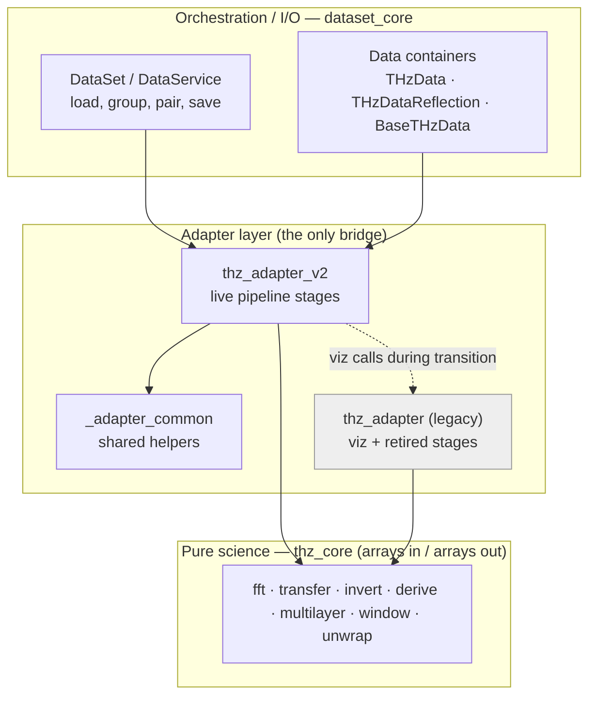

# THz Reflection Pipeline — Architecture & Data Contract

> **What this document is.** The map of the THz-TDS reflection analysis pipeline:
> the order of stages, what data flows between them, and the non-obvious rules that
> aren't visible in any single function. It is written to be read by both a human
> getting oriented and an AI agent that needs to understand the critical components
> and nuances *without re-reading the whole adapter every time*.
>
> **How it relates to the other docs:**
> - `readme.md` — repo structure and how to run.
> - `ANALYSIS_NOTES.md` — the *why*: physics decisions, validation, rationale (the
>   ADR log). This map links to it by section (`§N`) rather than duplicating it.
> - **This file** — the *what flows where*: the data-flow map and the
>   `processing_dict` contract.
>
> **Scope.** This describes the **live reflection pipeline** as driven by
> `run_me_low-level.py`, and is the specification the new `thz_adapter_v2`
> (+ `_adapter_common`) is being built against. See **Migration status** at the end.

---

## 1. Architecture layers



**The one hard rule:** `thz_core` is pure science — arrays in, arrays out, no file
I/O, no `DataSet`, no `processing_dict`. The adapter is the *only* place that
extracts arrays from containers, calls `thz_core`, and writes results back. Keep it
that way; it is what makes the science independently testable.

---

## 2. Data containers (read this before the contract)

The pipeline mutates **container objects in place**; the `processing_dict` (Section
4) is the shared blackboard they communicate through. Two container facts are
load-bearing for the entire contract:

- **`data_obj.data`** is *always* the averaged working array. Time-domain:
  `[time_s, mean, (stderr)]`. After `fft_spectrum`: `[freq_hz, |Y|, ∠Y]`. After
  later stages it is overwritten with that stage's primary 2–3 column result
  (`[freq, |H|, ∠H]`, `[freq, n, k]`, `[freq, eps.real, eps.imag]`). Treat
  `data_obj.data` as a *display/handoff* array; the authoritative complex results
  live in `processing_dict`.
- **`data_obj.raw_data`** is `[time_ps, scan1..scanN]` — the per-scan matrix in
  source units (ps). Don't conflate it with `.data` (SI seconds, averaged).

### The `THzDataReflection` delegation (critical nuance)

A `THzDataReflection` holds two `THzData` objects: `.first_reflection` and
`.second_reflection`. **It delegates `.data`, `.processing_dict`, `.filename`,
`.raw_data`, `.current_state`, etc. to `second_reflection`.** Consequences every
stage and reader must respect:

| Access | Resolves to |
|--------|-------------|
| `refl.data`, `refl.processing_dict` | **`refl.second_reflection`** (the back pulse) |
| `refl.first_reflection.processing_dict` | the **front** pulse (only path to it) |
| `refl.second_reflection.processing_dict` | same object as `refl.processing_dict` |

So when `transfer_function` reads `data_obj.processing_dict['fft_spectrum']` it gets
the **second-reflection** spectrum, and it reaches the front pulse explicitly via
`data_obj.first_reflection.processing_dict['fft_spectrum']`. `_resolve_segment(obj,
seg)` is the helper that returns the right holder for a named segment.

`refl.all_segments()` → `[('first_reflection', …), ('second_reflection', …)]` is the
canonical way to apply a step to both gates.

---

## 3. Pipeline data-flow

Live order as driven by `run_me_low-level.py`. Boxes are adapter stages unless
marked *(DataSet)* or *(viz)*. Arrow labels name the primary data handed forward.

```mermaid
flowchart TD
    L["DataSet.load_all_data()<br/><i>(DataSet)</i>"] -->|"THzData: raw_data, data=[t,mean,err]"| B

    B["build_full_trace_reflection"] -->|"THzDataReflection<br/>(2 copies of shared trace,<br/>isolated to 2 pulses, regions found)"| T
    T["taper_and_pad_traces"] -->|"centered + tapered both segments"| G
    G["group_files(['type'])<br/><i>(DataSet)</i>"] -->|"sample ↔ reference pairs"| R
    R["define_reflection_regions"] -->|"first_region / second_region (ps)"| BL
    BL["subtract_baseline"] -->|"baseline-removed both segments"| W
    W["window_pulses_fixed_width"] -->|"identical 2N+1 Hann on each peak"| MF

    MF["minimum_fft_length (guard)"] -->|"required n_fft"| F
    F["fft_spectrum ×2<br/>(second, then first)"] -->|"fft_freq, fft_spectrum<br/>+ abs-time phase ref"| TF

    TF["transfer_function (self-ref)"] -->|"transfer_H, transfer_mask,<br/>selfref_correction"| Q
    Q["selfref_quality<br/>(diagnostic, no data change)"] -->|"warn / ok"| INV
    INV["invert_nk_reflection<br/>geometry='window'"] -->|"reflection_r, n, k"| DE
    DE["deembed_air_gap_reflection<br/>(optional)"] -->|"n, k overwritten;<br/>n_window/k_window kept"| DV
    DV["derive_eps_sigma"] -->|"eps, sigma"| SV

    SV["save_database()<br/><i>(DataSet)</i>"] --> RV
    RV["result_viewer / plot_fft<br/><i>(viz, reads processing_dict)</i>"]
```



---

## 4. The `processing_dict` contract (frozen keys)

`processing_dict` is the shared blackboard. It is stringly-typed and unenforced, so
**these key names are frozen for phase-1 of the v2 migration** — `thz_adapter_v2`
must read/write the same names so legacy viz/consumers keep working. (Renames, if
any, come later in a dedicated pass once consumers move over.)

Keys marked **★** are read by downstream consumers (`result_viewer`, `plot_*`,
`export_results`, `save_database`) — breaking these breaks the GUI/output, not just
one stage.

| Key | Type | Written by | Meaning |
|-----|------|-----------|---------|
| `time_domain` | `[t,mean,err]` | container (`_average_data`) | original averaged trace |
| `pre_centering`, `centering_info` | array / dict | `taper_and_pad_traces` | trace + plan before centering |
| `baseline_metrics_first` | dict | `subtract_baseline` | baseline metrics |
| `pre_fixed_window`, `fixed_window` | array / dict | `window_pulses_fixed_width` | pre-window trace + window plan (peak_index, half_width_samples, clipped) |
| `time_domain_prefft` | `[t,y]` | `fft_spectrum` | windowed trace fed to the FFT |
| `fft_freq` **★** | array (Hz) | `fft_spectrum` | frequency grid (shared across segments) |
| `fft_spectrum` **★** | complex | `fft_spectrum` | spectrum **with abs-time phase ref** applied |
| `fft_metrics` | dict | `fft_spectrum` | FFT metrics |
| `transfer_H` **★** | complex | `transfer_function` | the measured ratio `H` (what inversion reads) |
| `transfer_mask` **★** | bool | `transfer_function` | SNR trusted-band mask (drives inversion + dims plots) |
| `transfer_metrics` | dict | `transfer_function` | incl. `diagnostics.{W_samp,W_ref,front_correction}` |
| `selfref_correction` | complex | `transfer_function` | `C = Y1_ref/Y1_samp` (front-pulse drift; diagnostic) |
| `mask_metrics`, `snr_mask` **★** | dict / bool | `transfer_function` | per-spectrum SNR (snr_mask on sample **and** ref) |
| `reflection_r` | complex | `invert_nk_reflection` | true sample reflection coeff `r = r_ref·H` |
| `reflection_geometry`, `theta_internal_rad`, `r_reference` | str / float / complex | `invert_nk_reflection` | geometry record |
| `n` **★**, `k` **★** | array | `invert_nk_reflection` | optical constants (overwritten by de-embed if enabled) |
| `invert_metrics` | dict | `invert_nk_reflection` | incl. `n_singular_bins` |
| `n_window`, `k_window` | array | `deembed_air_gap_reflection` | pre-de-embed (window-geometry) n,k preserved |
| `reflection_r_deembedded`, `air_gap_deembed`, `invert_metrics_deembedded` | complex / dict | `deembed_air_gap_reflection` | gap-corrected reflection + record |
| `eps` **★**, `sigma` **★**, `derive_metrics` | complex / complex / dict | `derive_eps_sigma` | permittivity + optical conductivity |

> Reminder: for a `THzDataReflection`, `processing_dict` is the **second**
> segment's. `fft_freq`/`fft_spectrum` for the **front** pulse live on
> `first_reflection.processing_dict`.

---

## 5. Live stages — overview

| # | Stage | Live function | Purpose | Key knobs |
|---|-------|---------------|---------|-----------|
| 1 | build | `build_full_trace_reflection` | Wrap each raw trace as a 2-segment `THzDataReflection` on one shared axis; isolate to the two pulses found within the search ranges (zeros the gap) and tighten `config.regions` to the data | `regions.*` (general search ranges) |
| 2 | center | `taper_and_pad_traces` | Peak-center + half-cosine taper + zero-pad both segments | `centering.{peak_mode,taper_ps}` |
| 3 | pair | `DataSet.group_files` *(DataSet)* | Pair sample ↔ reference by filename token | `keywords=['type']` |
| 4 | regions | `define_reflection_regions` | Resolve/select the two reflection time gates | `regions.*` |
| 5 | baseline | `subtract_baseline` | Remove DC baseline from both segments | `baseline.n_points` |
| 6 | window | `window_pulses_fixed_width` | One identical fixed-width Hann on every pulse peak (no shift) | `window.{type,alpha}`, `half_width_ps` |
| 7 | guard | `minimum_fft_length` | Smallest `n_fft` that won't truncate the traces | — |
| 8 | fft | `fft_spectrum` (×2) | Both segments → one freq grid, abs-time phase ref | `fft.{n_fft,norm,amplitude_scale}` |
| 9 | transfer | `transfer_function` | `H=(Y₂/Y₁)ₛ/(Y₂/Y₁)ᵣ` self-ref + SNR mask | `transfer.*`, `mask.*` |
| 10 | gate | `selfref_quality` | Flag unstable front-pulse correction `C` (diagnostic) | `selfref_quality.*` |
| 11 | invert | `invert_nk_reflection` | `H → n,k` via Fresnel (window geometry) | `geometry,theta_deg,polarization,n_window`, `invert.min_one_plus_r` |
| 12 | de-embed | `deembed_air_gap_reflection` *(opt)* | Strip contact air-gap, re-invert in air | `air_gap.*`, `geometry.theta_external_deg` |
| 13 | derive | `derive_eps_sigma` | `n,k → ε,σ` | `derive.eps_background` |
| 14 | view | `result_viewer`, `plot_fft` *(viz)* | Inspect results | `show_snr_mask` |

---

## 6. Per-stage I/O contract

Each block is the spec the v2 port follows. `Reads`/`Writes` are `processing_dict`
keys unless noted; `Calls` names the `thz_core` routine doing the maths.

```
### build_full_trace_reflection
Purpose : wrap each loaded THzData as a THzDataReflection with TWO copies of ONE
          shared trace (first + second), isolated to the two pulses.
Reads   : data_obj.raw_data (ps); config.regions.{first,second} as generous search ranges
Writes  : dataset.data[fn] ← THzDataReflection; obj.first_region/second_region = found ps;
          config.regions ← tightened (found) ranges (SELF-MODIFYING)
Knobs   : config.regions.{first_reflection,second_reflection} search ranges
Behaviour (regions defined): treats the two configured ranges as a dataset-independent
          general search window; finds the non-zero data extent inside each (trimming
          leading/trailing zero-pad or region overhang), clips the shared axis to
          [first_start, second_end], zeros the between-pulse gap, and writes the found
          ranges back to config.regions. Cross-file: uses the intersection of per-file
          found ranges so every file has real data in the kept window.
Behaviour (regions absent/None): fallback — keep the whole trace, leave regions None
          for define_reflection_regions to fill (supports interactive selection).
Notes   : the two pulses keep their true position on ONE axis (gap = zeros) so the
          inter-pulse delay survives for self-referencing. GaP echoes are excluded by
          the second-region trailing edge + the outside-region zeroing.
```
```
### taper_and_pad_traces
Purpose : center the main pulse at the array midpoint by zero-padding the shorter
          side, with a half-cosine taper at the pad↔signal junction. Both segments.
Reads   : config.centering.{peak_mode,taper_ps}; each segment holder .data [t,y]
Writes  : holder.data (centered); holder.processing_dict[pre_centering, centering_info]
Knobs   : centering.peak_mode ('auto'|'manual'), centering.taper_ps
Notes   : discovers segments via __dict__ keys ending '_reflection' (fragile — a
          v2 cleanup candidate: use all_segments()/_resolve_segment). taper_ps kwarg
          is shadowed by the config read.
```
```
### define_reflection_regions
Purpose : resolve both reflection gates from config or an interactive SpanSelector.
Reads   : config.regions.{first_reflection,second_reflection} (ps) or None;
          representative obj .data
Writes  : every obj .first_region/.second_region (ps tuples); config.regions mirrored
Knobs   : regions.* (None → interactive)
```
```
### subtract_baseline  → _subtract_baseline_reflection
Purpose : remove DC baseline (first n_points mean) from BOTH segments + per-scan matrix.
Reads   : config.baseline.n_points (10); both segment holders .data; show_graph
Writes  : first/second_reflection.data; processing_dict[baseline_metrics_first];
          per-scan working matrix adjusted in lockstep
Knobs   : baseline.n_points
Calls   : core.subtract_baseline
```
```
### window_pulses_fixed_width
Purpose : drop ONE identical (2N+1)-sample symmetric window on each pulse's peak;
          zero outside; never shift the data.
Reads   : config.window.{type,alpha}; holder .data; obj .first_region/.second_region
          (peak search only); half_width_ps (kwarg)
Writes  : holder.data (windowed); processing_dict[pre_fixed_window, fixed_window]
Knobs   : half_width_ps, window.type ('hann'|'tukey'|'boxcar'), window.alpha
Notes   : INVARIANT = equal dt across files (NOT equal length); n_fft reconciles
          lengths downstream. Prints a clip warning if a pulse is too near an edge.
```
```
### minimum_fft_length
Purpose : largest sample count across files/segments = smallest n_fft that won't
          truncate (rfft truncates when n_fft < len(y), cutting the late pulses).
Reads   : holder.data shapes
Returns : int (used to assert/derive config.fft.n_fft)
```
```
### fft_spectrum   (called twice: 'second_reflection', then 'first_reflection')
Purpose : FFT each segment onto ONE shared freq grid (same n_fft).
Reads   : holder.data [t,y]; config.fft.{norm,amplitude_scale}; n_fft (kwarg)
Writes  : holder.processing_dict[fft_freq, fft_spectrum, fft_metrics, time_domain_prefft];
          holder.data ← [freq,|Y|,∠Y]; holder.current_state = 'frequency_domain'
Knobs   : n_fft, fft.norm, fft.amplitude_scale
Notes   : CRITICAL — for THzDataReflection applies abs-time phase ref
          exp(-2πi·f·t[0]) to BOTH segments (each w.r.t. its own t[0]) so W=Y₂/Y₁
          encodes only the true inter-pulse delay and is shift-invariant. Applying
          it to one segment only leaked a linear phase into H (Audit 1). Plain
          THzData (transmission) is EXCLUDED — its phase stays trace-relative.
```
```
### transfer_function   (ref_type='reference')
Purpose : self-referenced transfer H = (Y2_s/Y1_s)/(Y2_r/Y1_r) + SNR trusted mask.
Reads   : data_obj.processing_dict[fft_freq,fft_spectrum] (second, via delegation);
          data_obj.first_reflection.processing_dict[fft_spectrum] (front);
          ref via dataset.get_reference(fn, ref_type); config.transfer.*, config.mask.*
Writes  : processing_dict[transfer_H, transfer_metrics, transfer_mask,
          selfref_correction, mask_metrics]; snr_mask on sample AND ref;
          data_obj.data ← [freq,|H|,∠H]; data_obj.reference_filename
Knobs   : transfer.self_reference, transfer.apply_snr_mask,
          transfer.first_reflection_dir (legacy disk layout), mask.*
Calls   : core.self_referenced_transfer | core.transfer_function; core.trusted_band_mask
Notes   : self-ref skips the sub-sample timing ramp (front pulse carries timing).
          ANALYSIS_NOTES §11; Audit 1/2.
```
```
### selfref_quality   (DIAGNOSTIC — changes no data)
Purpose : flag acquisitions whose front-pulse correction C=Y1_r/Y1_s is structured
          (front spot drifted). std(|C|) separates good (~0.01) from bad (~0.53).
Reads   : processing_dict[selfref_correction, fft_freq, transfer_mask];
          config.selfref_quality.*
Writes  : nothing (returns dict; prints WARN/ok)
Knobs   : selfref_quality.{band_thz,std_threshold,median_dev_threshold,use_snr_mask}
Notes   : do NOT divide H by C — H/C = Y2_s/Y2_r re-injects the timing self-ref
          cancels (audited). It's a quality flag, not a corrector.
```
```
### invert_nk_reflection   (geometry='window')
Purpose : H → n,k via the single-interface Fresnel closed form.
Reads   : processing_dict[transfer_H, transfer_mask, fft_freq]; config.invert.*
Writes  : processing_dict[reflection_r, reflection_geometry, theta_internal_rad,
          r_reference, n, k, invert_metrics]; data_obj.data ← [freq,n,k]
Knobs   : geometry ('window'|'gold'), theta_deg (EXTERNAL), polarization ('s'),
          n_window (SiO2≈1.96, scalar or per-f array), invert.min_one_plus_r
Calls   : core.invert_nk_reflection (+ _resolve_reflection_geometry)
Notes   : near-mirror guard — r→−1 is singular; |H|>1 is unphysical (coupling
          artifact) and warned. ANALYSIS_NOTES §1, §6b.
```
```
### deembed_air_gap_reflection   (optional; config.air_gap.enabled)
Purpose : strip a contact gap (SiO2|air d|CNT), re-invert with AIR incidence so the
          saved n,k,σ are gap-corrected (removes the spurious ~0.6 THz Lorentzian).
Reads   : processing_dict[fft_freq, reflection_r, r_reference, transfer_mask, n, k];
          config.air_gap.{position_um,width_um,max_boost}; geometry.theta_external_deg
Writes  : processing_dict[n_window, k_window (preserved), reflection_r_deembedded,
          n, k (OVERWRITTEN), air_gap_deembed, invert_metrics_deembedded]; data_obj.data
Knobs   : air_gap.* (position_um is UNCALIBRATED — pin with a Si benchmark)
Calls   : core.invert_nk_reflection (n_incident=1 at θ_gap)
Notes   : run AFTER invert_nk_reflection, BEFORE derive_eps_sigma. ANALYSIS_NOTES §9/§9b.
```
```
### derive_eps_sigma
Purpose : ε, σ from n,k.  σ = -iω·ε0·(ε - eps_background).
Reads   : processing_dict[n, k, fft_freq]; config.derive.eps_background
Writes  : processing_dict[eps, sigma, derive_metrics]; data_obj.data ← [freq,ε.real,ε.imag]
Knobs   : derive.eps_background (1.0 vacuum; 11.7 Si). Affects σ_imag only.
Calls   : core.derive_eps_sigma
```

---

## 7. Invariants & nuances (the stuff that bites)

1. **Abs-time phase reference** (`fft_spectrum`): both reflection segments get
   `exp(-2πi·f·t[0])` w.r.t. their own `t[0]`. This makes `W=Y₂/Y₁` encode only the
   physical inter-pulse delay and invariant to a rigid axis shift. One-sided
   application leaks a linear phase into `H`. Transmission (`THzData`) is excluded.
   *(Audit 1; ANALYSIS_NOTES §11.)*
2. **No time-alignment in the self-ref path.** Self-referencing forms each trace's
   own internal clock; `align_to_reference` is unnecessary and was *harmful* here
   (it shifted only the sample → leaked phase). It remains only for the non-self-ref
   path.
3. **`C` is a diagnostic, not a corrector.** `H/C = Y2_s/Y2_r` discards the
   self-referencing. `selfref_quality` warns; it never edits data.
4. **dt-not-shape invariant** (`window_pulses_fixed_width`, `fft_spectrum`): files
   may differ in *length*; they must share the sample step `dt`. `n_fft` (≥
   `minimum_fft_length`) reconciles lengths onto one frequency grid. The dt check
   uses `rtol` with `atol=0.0` (dt~1e-13 s would pass np.isclose's default atol).
5. **`n_fft` truncation guard.** `rfft(y, n_fft)` truncates when `n_fft < len(y)`,
   cutting the late-sitting pulses. Always assert `n_fft ≥ minimum_fft_length`.
6. **De-embed overwrites `n`/`k`.** After `deembed_air_gap_reflection`, the primary
   `n`/`k` are gap-corrected; the window-geometry values survive as
   `n_window`/`k_window`. Anything reading `n`/`k` gets the de-embedded result.
7. **Container delegation** (Section 2): `refl.processing_dict` is the *second*
   segment's; the front pulse is only at `refl.first_reflection.processing_dict`.
8. **Two single-sources-of-truth.** `processing_dict` (data) and `dataset.config`
   (parameters). Stages resolve config as
   `config or getattr(dataset,'config',None) or {}`. v2 exposes buried knobs as
   explicit override kwargs without changing the config schema.

---

## 8. Migration status (strangler-fig)

| Concern | Decision |
|---------|----------|
| New module | `dataset_core/adapters/thz_adapter_v2.py` (one overarching adapter first; split reflection/transmission later) |
| Shared helpers | `dataset_core/adapters/_adapter_common.py` — **only `thz_adapter_v2` imports it** for now (old `thz_adapter` left untouched; duplication cleaned up at retirement) |
| `processing_dict` keys | **frozen** (Section 4) — no renames in phase 1 |
| Config schema | unchanged — existing `run_me_low-level.py` config works as-is |
| Visualization | `result_viewer`, `plot_fft`, slider explorer stay in legacy `thz_adapter`; v2 run script calls across the boundary |
| Legacy siblings | not ported (e.g. `isolate_and_window`, `build_reflection_dataset`, `centering_manual`, grid inverters); they retire with the old module |
| Retirement gate | old-vs-v2 parity on the real CNT dataset (diff `n`, `k`, `σ`) before rewiring the other 42 importers |

**Ported to v2:** _(update as we go)_

- [ ] `build_full_trace_reflection`
- [ ] `taper_and_pad_traces`
- [ ] `define_reflection_regions`
- [ ] `subtract_baseline`
- [ ] `window_pulses_fixed_width`
- [ ] `minimum_fft_length`
- [ ] `fft_spectrum`
- [ ] `transfer_function`
- [ ] `selfref_quality`
- [ ] `invert_nk_reflection`
- [ ] `deembed_air_gap_reflection`
- [ ] `derive_eps_sigma`
