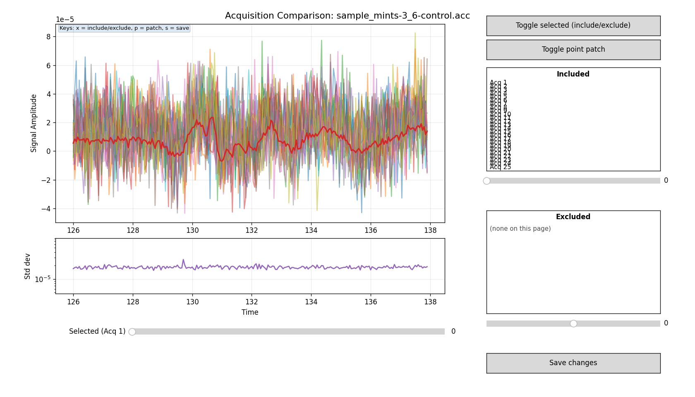

# Acquisition editor

A standalone, interactive tool for reviewing and cleaning THz time-domain
scans before they go into analysis. It opens each `.acc` file, shows every
individual acquisition on top of each other, and lets you:

- **step through the acquisitions one by one** and watch how they evolve
  over the course of a measurement (purge settling, drift);
- **exclude** whole acquisitions that are noisy, spiked, or taken before the
  purge had settled;
- **patch** single-point spikes (table knocks) without throwing away the
  whole scan;
- **crop** the time window;
- **export** the cleaned data as a new `.acc` (kept scans) plus a `.dat`
  (their average), in the instrument's own file format.

The original files are never modified. Everything is written to an
`export/` sub-folder, and that is what you then analyse.

It needs only `numpy` and `matplotlib`. It does not depend on the rest of the
`thz` analysis code, so you can copy the `acquisition_editor/` folder to any
machine with Python and use it on its own.

> **Status note.** This is a manual assessment tool. An automatic purge
> model/monitor that tracks water-vapour equilibration scan by scan is
> planned for the analysis pipeline; today the pipeline only *flags*
> suspected under-purged data (the `purge_still_equilibrating` diagnostic)
> and this editor is how you look and decide for yourself.

---

## 1. Quick start

Create a small run script (there is one at the repo root,
`acq_editor_run_me.py`) containing:

```python
import acquisition_editor

acquisition_editor.process_directory(r"C:\path\to\your\measurement_folder")
```

and run it from the repository root (or from any folder that contains
`acquisition_editor/`):

```
python acq_editor_run_me.py
```

For each `.acc` file in that folder, in alphabetical order, the editor
window opens. Review the scans, then press **Save changes** (or the `s`
key). The next file opens automatically. When the last one is done you
will find:

```
measurement_folder/
    sample_x.acc                 <- untouched originals
    reference_y.acc
    export/
        sample_x.acc             <- kept scans only, renumbered 1..N
        sample_x.dat             <- mean of the kept scans
        reference_y.acc
        reference_y.dat
```

Closing a window without saving keeps that file's data exactly as it was
(all scans, full time window) and still exports it. So if you are happy
with a file, closing it is the same as accepting it.

If you only want the averaged `.dat` files and do not need to look at
anything:

```python
acquisition_editor.convert_directory(r"C:\path\to\your\measurement_folder")
```

---

## 2. The editor window



**Top-left, main plot.** Every included acquisition is drawn as a thin grey
line. The currently *selected* acquisition is drawn thick and green. The
thick red line is the **mean of the included acquisitions**, i.e. exactly
what the exported `.dat` will contain. Excluded acquisitions disappear from
the plot.

**Below it, standard-deviation panel.** The point-by-point standard
deviation across the included acquisitions, on a log scale. This is your
noise map. It should be flat and featureless; any bump means the included
scans disagree at that time, which is where you should look.

**Selected slider.** Steps through the acquisitions in the order they were
recorded. Acquisition 1 is the first one the instrument took.

**X min / X max text boxes.** Type a value and press Enter to crop the time
window. The crop applies to the display *and* to the export (see §6).

**Right column.** Buttons, plus two lists showing which acquisitions are
included and which are excluded. Clicking a name in either list toggles it.
The small slider under each list pages through long lists (25 per page by
default; pass `page_size=15` to `process_directory` if the list is cramped).

### Controls

| Action | Mouse | Key |
|---|---|---|
| Select an acquisition | drag the **Selected** slider, or click its name in a list | |
| Exclude / re-include the selected acquisition | **Toggle selected** button | `x` |
| Select a data point (on the selected acquisition) | click on the main plot | |
| Patch / restore the selected point | **Toggle point patch** button | `p` |
| Crop time window | type in **X min** / **X max**, Enter | |
| Save and move to the next file | **Save changes** button | `s` |
| Discard edits for this file | close the window | |

Clicking in the plot selects the point *nearest in time* on the selected
(green) acquisition and marks it with a gold dot. You must select the
acquisition first (slider or list), then click the point. Points can only
be selected on included acquisitions.

---

## 3. Workflow: judging when the purge is good enough

The instrument records the scans in the order they were taken, and the
editor presents them in that order. So a `.acc` file is a time series of
the measurement conditions, and the most useful thing to do with a new
dataset is to **acquire while the purge is still running and then walk
through the scans** with the **Selected** slider.

What you are looking for:

- **Ringing after the main pulse.** Water vapour lines show up as
  oscillations trailing the THz pulse. As the nitrogen displaces room air
  these oscillations shrink. Watch the tail, not the peak.
- **Peak amplitude creeping up.** Water absorption grows with frequency,
  so an equilibrating purge makes the pulse both taller and sharper over
  time. When successive scans stop changing, you are there.
- **The std-dev panel.** While the purge is still settling, the early
  scans differ systematically from the late ones and the standard
  deviation across all of them shows structure in the tail. Excluding the
  early scans one by one, you will see that structure collapse to a flat
  floor. That is the practical test: keep excluding from the start until
  the std-dev trace stops improving.

Then exclude everything before that point and save. The exported file
holds only the settled scans. This makes "acquire while purging" a
perfectly good strategy: rather than waiting for a purge you cannot see,
you record continuously and trim afterwards.

Two cautions:

- The **sample and reference must be treated the same way.** If you keep
  only the last 15 scans of the sample, do not average all 40 of the
  reference. A sample and reference recorded through different amounts
  of water vapour give a systematic error that no averaging removes.
- Excluding scans costs signal-to-noise: the averaged noise floor scales
  as 1/√N. Ten clean scans beat thirty contaminated ones, but do not trim
  more than the data justifies.

---

## 4. Workflow: spikes from table knocks (OPTP in particular)

Optical-pump THz-probe (OPTP) measurements are small differential signals
riding on a large pump-induced background, and the recorded value at each
delay point is very sensitive to the optical path. Someone knocking or
leaning on the table during a scan puts a **single sharp spike** into
that scan at whatever delay the stage happened to be at. It is usually
obvious in the main plot as one point far outside the band of the other
scans, and it appears as a narrow tall bump in the std-dev panel.

To fix it:

1. Find the spike in the std-dev panel. Its time position tells you where
   to look.
2. Step through the acquisitions with the slider until the green line is
   the one carrying the spike.
3. Click on the spike in the main plot. The gold marker snaps to the
   nearest point.
4. Press `p` (or **Toggle point patch**). The point is replaced by the
   average of its two neighbours and the std-dev bump disappears.
   Press `p` again to restore the original value if you picked the wrong
   point.

Patching is meant for isolated, single-point glitches. If the disturbance
lasts several points (a burst, a slow wobble), do not patch them one by
one: exclude the whole acquisition instead (`x`). Patching many adjacent
points invents data.

---

## 5. Workflow: the one noisy scan in a set

It sometimes happens that most scans in a file are fine and one or two
have visibly more noise across the whole trace, presumably from something
environmental (air currents, an electrical transient, a door). These show
up as:

- a raised std-dev floor everywhere, not a localised bump;
- one grey trace that looks fuzzier than the rest when you step through
  with the slider.

Select it and press `x`. Watch the std-dev floor drop. If it does not
drop, that scan was not the problem: re-include it and keep looking.

---

## 6. Cropping the time window

Typing new values into **X min** / **X max** restricts the time axis. On
save, the exported `.acc` and `.dat` contain only that window, for every
scan. Use this to drop dead time at the start of a scan or a trailing
region you know is contaminated.

Be careful with what you cut off:

- The **usable frequency resolution** of a THz scan is set by the length
  of the time window (Δf ≈ 1/T). Cropping the tail coarsens your spectrum.
- **Echoes and second reflections** late in the trace are sometimes needed
  by the analysis (thickness determination, reflection geometry). Do not
  crop them off unless you are sure the analysis does not use them.
- The crop is a hard cut, not a window function. The analysis pipeline
  applies its own windowing; leave it enough room to do so.

If in doubt, do not crop. Leave the full trace and let the analysis
choose its regions.

---

## 7. What the output files contain

**`export/<name>.acc`** — the kept scans, in the same multi-scan format the
instrument writes (`%`-prefixed header lines, scans separated by `%%`,
`%.18e` numbers, Windows line endings). Scans are renumbered 1…N in the
`title … acc N` line, so an exported file with 12 scans looks exactly like
a 12-scan acquisition. Patched points are baked in; excluded scans are
gone. The analysis pipeline reads these exactly as it reads originals.

**`export/<name>.dat`** — the mean of the kept scans, single column, with
the `acc N` suffix stripped from the title and a
`param accumulations,<N>` line added so the scan count is on record.

Two limitations to be aware of:

- **Per-scan timestamps are reassigned by position, not by identity.** The
  editor does not track *which* scans you kept; on export the first N
  per-scan headers are attached to the N kept scans. If you excluded scans
  from the middle of a run, the `Date and time` stamps in the exported
  `.acc` no longer belong to the scans they sit above. This does not
  affect the data or the analysis, but if you want to study drift *versus
  time* across a run, do it on the original file, not the export.
- The exported `.dat` header carries only what the `.acc` per-scan headers
  carry (title, date, a few flags). The instrument's own `.dat` also lists
  lock-in settings and delay-line positions; those are not in the `.acc`
  and so cannot be reproduced. Keep the instrument's `.dat` if you need
  them.

One more thing the loader does silently: if the time axis of a file has
gaps (split scans that recorded two separate windows), the missing region
is filled with zero-valued points so that all scans share one uniform
axis. This is reported in the console as `[gap fill] …` when it happens.

---

## 8. Good practice

- **Never analyse the originals after editing.** Point the analysis at
  `export/`. Keep the originals; disk is cheap and the raw record is the
  only thing you cannot regenerate.
- **Exclude for a reason you could write down.** "Purge not settled",
  "spike at 131.4 ps", "scan 7 noisy across the whole trace" are all fine.
  "This one made the average look better" is not: that is cherry-picking,
  and it biases the result. The std-dev panel is your objective guide.
- **Record what you removed.** The console prints `Kept N of M
  acquisition(s)` for each file. Copy that into your lab notes along with
  why.
- **Treat sample and reference symmetrically** (see §3).
- **Do not use point-patching as a smoothing tool.** One point per knock.

---

## 9. Using it from Python instead of the batch workflow

Everything `process_directory` does is available piecewise:

```python
import acquisition_editor as ae

data = ae.load_file("sample_x.acc")        # dict: filename, header, scan_headers, data
# data["data"] is an array of shape (n_points, 1 + n_scans): time | scan1 | scan2 | ...

edited = ae.edit_data(data, page_size=25)  # opens the editor, returns the same dict shape
ae.save_acc(edited, "export/sample_x.acc")
ae.save_dat(edited, "export/sample_x.dat")
```

`edit_data` returns the original dict unchanged if you close the window
without saving.

If you already have the data loaded in the main analysis pipeline, a
`DataSet` object exposes the same editor through
`dataset.modify_acquisitions(in_place=True)`, which applies your edits
directly to the loaded objects. The batch workflow above is the
recommended route for routine cleaning because it leaves a file trail.

---

## 10. Related tool: joining and splitting `.acc` files

`acc_file_manager.py` at the repository root is a small GUI (built on the
same load/save code) that can **join** several `.acc` files into one, or
**split** one file into two, either at a scan number or by even/odd
interleaving. Typical uses:

- you acquired a sample in two sittings and want one file to average;
- you want to split a long run into "first half" and "second half" to
  check that the result does not depend on when it was taken (a simple
  drift test).

Run it with `python acc_file_manager.py`.
