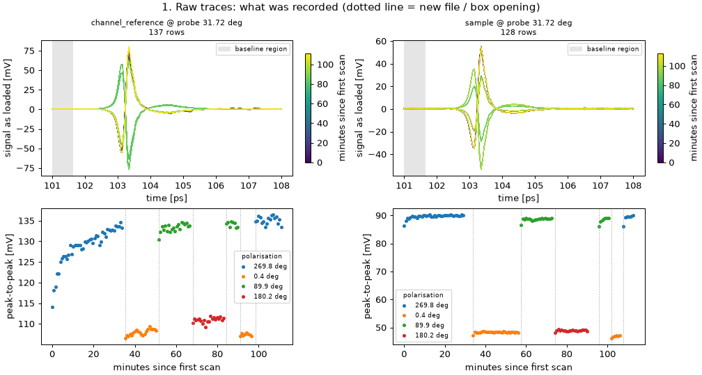
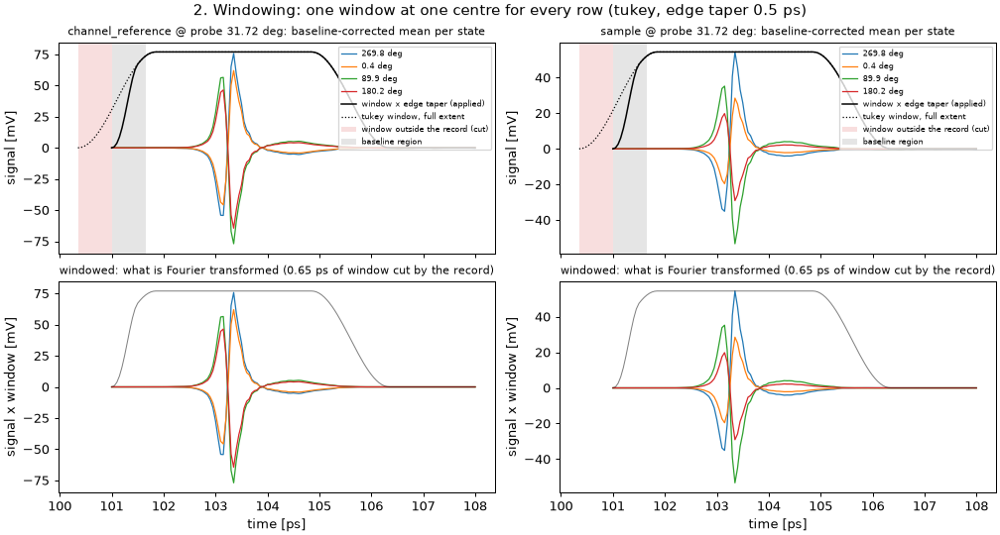
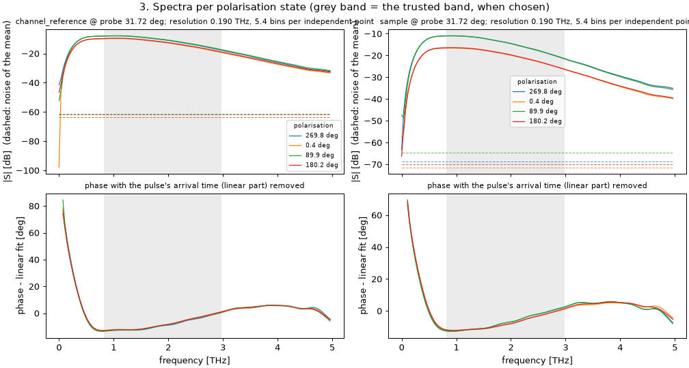
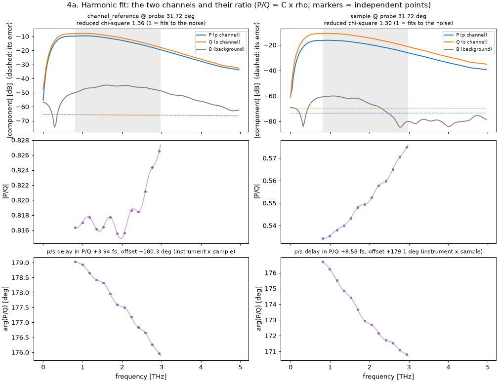
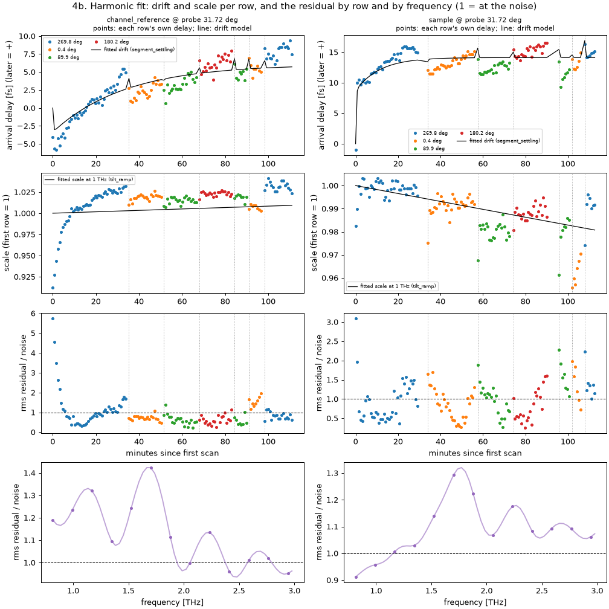
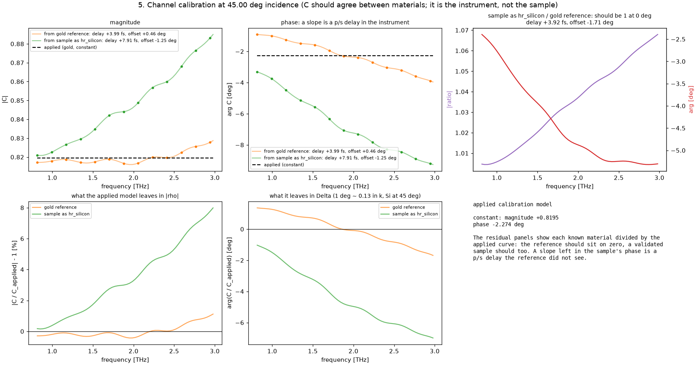
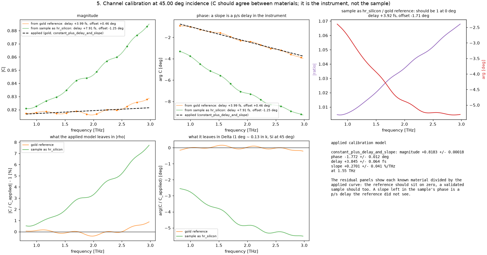
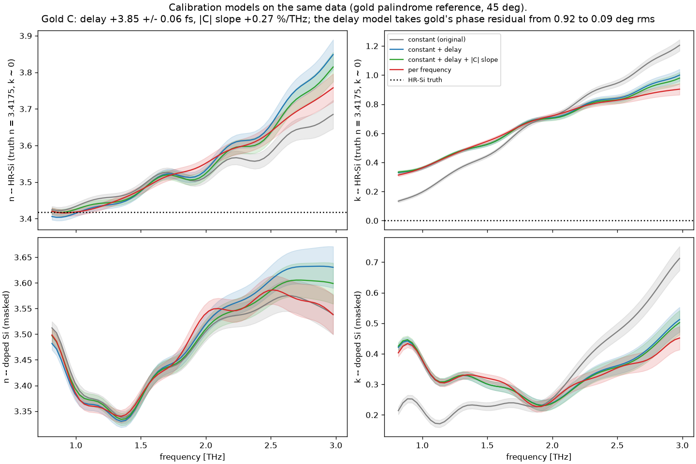
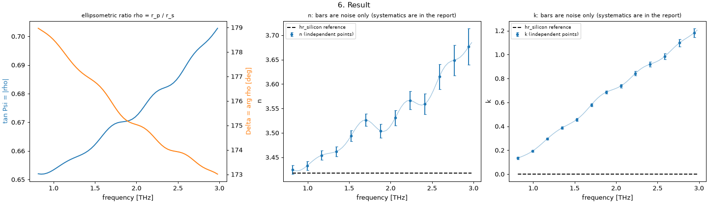
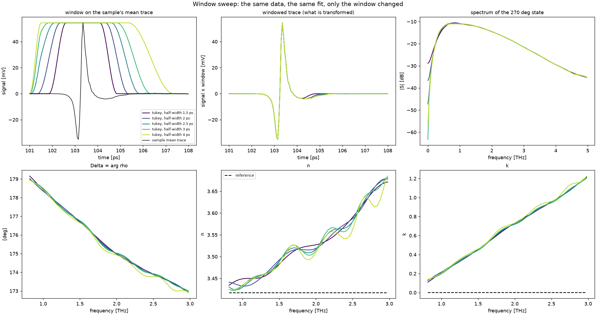

# The harmonic fit, step by step — a tutorial for reading an ellipsometry run

This is a guide to what `thz_ellipsometry_run_me.py` does to your data and how to read the six
groups of figures it shows (stepwise during a run, saved in every bundle, and redrawn by
`thz_ellipsometry_view.py <bundle>`). The heart of it is the **harmonic fit**, so most of the
document is about that: what it assumes, what it extracts, what it removes, and how you can tell
from the figures whether it worked.

The example figures are from the HR-Si wafer of 2026-10-07 (palindrome 0, 90, 180, 270, 180, 90,
0) calibrated on the gold palindrome of 2026-10-08, at 45° — a real run with real problems, which
is more instructive than a clean simulation. Lab notebook F45/F46 describe that data.

---

## 0. The idea in one paragraph

You never measure r_p or r_s on their own — every THz measurement carries an unknown
instrument (pulse spectrum, detector response, sample height, gain). Ellipsometry measures the
**ratio** ρ = r_p / r_s instead, in one geometry, without moving the sample: the emitter's
magnet rotates the THz polarisation, so the same pulse path carries a p component and an s
component, and everything that multiplies both — the spectrum, the gain, the sample height —
cancels in the ratio. The harmonic fit is the step that pulls the p part and the s part out of a
series of measurements at different polarisation angles, while removing whatever changed during
the series (timing drift, power drift) and whatever does not depend on the polarisation at all
(a background).

---

## 1. The measurement model

### Field-standard view

The spintronic emitter radiates a THz field whose polarisation follows the magnet. At
polarisation angle α (measured from p):

    E_in(α) = E₀ (cos α p̂ + sin α ŝ)

The sample reflects each component with its own Fresnel coefficient, and the detector (GaP at a
fixed probe azimuth) projects each reflected component onto its own sensitivity, d_p and d_s:

    S(α, f) = d_p r_p E₀ cos α + d_s r_s E₀ sin α
            = P(f) cos α + Q(f) sin α

So **the signal is a first harmonic in α**: two complex numbers per frequency, P = d_p r_p E₀ and
Q = d_s r_s E₀, describe every polarisation angle. Their ratio is

    P / Q = (d_p / d_s) · (r_p / r_s) = C · ρ

E₀ — the pulse spectrum, the laser power, the sample-height phase, the purge absorption along the
path — has cancelled. What remains is ρ, which you want, and C = d_p/d_s, a property of the
detection alone, which the calibration step removes (section 5).

### Microscopic view

Why do p and s reflect differently? Think of the surface atoms as small dipoles driven by the
incoming field. For s polarisation the field lies in the surface plane, perpendicular to the
plane of incidence: every dipole oscillates parallel to the surface, and the reflected wave is
their coherent re-radiation, which for a high-index surface is strong and in antiphase
(r_s ≈ −0.65 for Si at 45°). For p polarisation the field has a component *normal* to the surface;
dipoles driven along the normal radiate weakly in the specular direction (a dipole does not
radiate along its own axis), so r_p is smaller and, at Brewster's angle, vanishes entirely. The
ratio ρ therefore encodes how the material's polarisability responds to the two directions —
which is exactly what n and k describe. A metal (gold) has so many free electrons that both
directions are screened completely: r_p ≈ r_s ≈ −1 up to sign conventions, so ρ_gold ≈ −1 at any
angle — which is why gold is the natural reference for C.

### The full model the fit uses

Real rows are not that clean. Each row k (one scan, or one file's average) at angle α_k and time
t_k is modelled as

    S_k(f) = [ P cos α_k + Q sin α_k + B ] · a_k(f) · exp(+i 2π f τ_k)

| term | what it is | where it comes from physically |
|------|------------|--------------------------------|
| P, Q | the p and s channels — the answer | the sample and the detector |
| B | a **background**: the same at every α | optical rectification in the emitter substrate, pump leakage, electrical pickup — anything that does not flip with the magnet |
| a_k(f) | the row's **scale** (amplitude model) | laser power drift; purge water absorption (it tilts with frequency: water absorbs more at high f) |
| τ_k | the row's **delay** (drift model) | path length changes: the purge refractive index changing as the air dries, thermal expansion of the delay line |

P, Q and B are solved exactly (linear least squares, per frequency, weighted by the measured
noise). τ_k and a_k are described by a few parameters shared across all frequencies and found
by a nonlinear search around that linear solve. The models are registries in
`thz_ellipsometry/core/harmonic.py` (`DRIFT_MODELS`, `AMPLITUDE_MODELS`).

**Sign convention.** With numpy's FFT a pulse that arrives later has phase −2πfτ. The fit's τ_k
enters as exp(+i2πfτ), so a positive fit τ is an *earlier* arrival. The inspection figures
convert to **arrival delay: later = positive**, which is the intuitive one. When a figure
reports a "p/s delay" it is the delay of the p channel relative to the s channel, later =
positive.

---

## 2. Why a fit, and what makes it trustworthy

### Two states would do — on a perfect instrument

At α = 0 you get P, at α = 90° you get Q. Done. Every other choice in the acquisition is there to
defeat something that a perfect instrument would not have:

* **180° and 270° kill the background.** S(180°) = −P + B, S(0°) = P + B: the difference is 2P,
  the sum is 2B. With 0/90/180/270 the background is removed *exactly* (the fit with a B column is
  identical to this differencing — there is a test that says so).
* **Repeats and the noise model** make P and Q a weighted average and give them honest error
  bars.
* **Revisiting states** (a palindrome) is what separates drift from the answer — the subtle part,
  next.

### The drift problem

P and Q are not measured at the same time: the p state is recorded, then the magnet turns, then
the s state. A delay drift δτ between those two moments multiplies Q by exp(i2πf δτ) and not P.
In the ratio:

    P/Q → C ρ · exp(−i2πf δτ)

That is a phase error growing linearly with frequency — **indistinguishable from a p/s delay in
C, or from absorption in the sample**. At 45° on silicon, 1° of phase error in ρ is 0.13 in k
(F46), and 1 fs is 0.7° at 2 THz. So drift of a few fs between states, if not removed, is a
large error in k. Common drift (the same for p and s) cancels; *differential* drift does not.

The fit removes it by modelling τ(t). But a model can only separate drift from P/Q if the data
contain a state measured **twice at different times**: the difference between two visits to the
same state cannot be P/Q (P/Q did not change) — it can only be drift. That is why the palindrome
(0, 90, 180, 270, 180, 90, 0) matters: every state except 270 is revisited, and the revisits pin
the drift. A single pass (0, 90, 180, 270) leaves the drift and the P/Q phase degenerate; the
fit still returns numbers, but they rest on the assumed *shape* of the drift, not on data
(`drift_separable_from_ratio` diagnostic, F40).

### Rows: per file or per scan

`config['acquisition']['rows']`:

* `"acquisition"` — one row per file (the average of its scans). The drift model then sees one
  point per file: it cannot see drift *inside* a file.
* `"scan"` (default) — one row per repeat scan. The drift inside every file is visible, so a
  smooth purge settle can be fitted continuously. The drift model for this is
  `segment_settling`: one slow settling trend over the whole block, plus a short transient after
  each box opening (each new file). Its known blind spot: a *lasting step* at an opening looks
  exactly like a change of state, and only a revisit reveals it (F44).

### Weighting and chi-square

Every row's noise is measured from its own repeat scans (thz-core `drift_corrected_scatter`,
with the scan-to-scan drift removed inside the estimator so drift is not counted as noise),
propagated exactly through the window into a variance per frequency. The fit is weighted by it,
and the **reduced chi-square** compares what is left over with that noise:

* **≈ 1**: the model describes the data to within the noise. Good.
* **1.2–2**: small structure the model does not describe. Look at figure 4b to see where.
* **≫ 2**: something the model does not have — a magnet that did not saturate, a drift shape it
  cannot follow, a misread filename.
* **≪ 1**: the noise is overestimated (rare).

Neighbouring frequency bins are **not independent**: zero padding interpolates between them. The
true resolution is 1/T of the windowed record (≈0.19 THz for a 5.25 ps record), and the band has
≈5× more bins than independent points. The figures mark the independent points with dots; the
error bars on the shared drift parameters are scaled by √(oversampling) for the same reason.

---

## 3. Reading the figures

Each run shows (and saves) these, one step at a time. One column per series: the gold reference
first, then the sample.

### 1 — Raw traces

**Top:** every scan as loaded, coloured by time. The grey band is the baseline region (its mean
is subtracted). **Bottom:** peak-to-peak of every scan against time, coloured by polarisation
state; dotted lines are new files (each one a box opening and magnet move).

**What to look for**

* States should form **flat bands**. A band that slopes is drift; a band that curves and
  flattens is a purge settling — here the gold's first state (blue, 0–35 min) rises 12% as the
  box dries after closing. That is why its first file was long.
* **Revisits** (the same colour later) should land on the earlier level. A revisit that is
  *lower in amplitude with the same timing* points to a magnet re-setting error (F45: 0.8° on the
  HR-Si 90° return). Compare the band amplitude too (the `live` bench tool): peak-to-peak and the
  0.8–3 THz amplitude can disagree by ~1%.
* The **first scan of each file** often sits apart from the rest (several fs, ~1% amplitude —
  see the first points after each dotted line). It is a real feature of the acquisition, not yet
  understood.
* p and s states at very different amplitudes are normal: that is |ρ| (0.65 for Si at 45°) times
  |C|.

### 2 — Windowing

**Top:** the baseline-corrected mean trace of each state, with the window over it. Solid black:
the weighting actually applied (window × record-edge taper). Dotted: the window's full extent.
Red: the part of the window that fell *outside the record* and was cut. **Bottom:** the
windowed traces — exactly what is Fourier transformed.

**What the choices are and why**

* **One window, one centre, for every row** of a series (found from the mean of all of them).
  Windowing each trace at its own peak would delete the very timing differences between states
  that the drift model measures.
* **Flat-top Tukey, not Hann.** Under a sloped window, a pulse that drifts also changes
  amplitude (the window weight under it changes). With a flat top over the pulse, drift is a pure
  phase — which is what the drift model assumes. (Hann gave chi-square 9 on simulated drift;
  Tukey 1.1 — F38.)
* **Truncated, not resized.** The bench records start ~2.4 ps before the pulse; a 3 ps
  half-width window would start before the record. The window keeps its shape (the flat top stays
  on the pulse) and the cut part is simply missing; the record's own first 0.5 ps is ramped to
  zero so the FFT sees no step. The run reports the cut as a finding (`window_inside_record`).

**What to look for:** everything you care about (the main pulse *and* the s pulse, which is
shifted and reshaped relative to the p pulse because r_s ≠ r_p) inside the flat top; echoes
(emitter substrate, GaP, the sample's back face) outside the window. Section 6 explains how to
see what changing the window does.

### 3 — Spectra

**Top:** amplitude (dB) of each state's mean spectrum; dashed in the same colour, the noise of
that mean from the noise model. Grey: the trusted band. **Bottom:** phase with its straight-line
part (the arrival time) removed, so only the *shape* of the phase is left.

**What to look for**

* Signal-to-noise: the gap between solid and dashed. Here, on gold, ~55 dB at 1 THz and ~45 dB at
  3 THz.
* Opposite states (0 and 180, 90 and 270) should overlay in amplitude — the magnet only flips
  the sign. If they do not, the magnet is not saturating, or there is a large background.
* After removing the linear phase, all states should share one curve (the emitter and the
  detector response). A state whose phase curve differs in *slope* arrived at a different time —
  drift. A difference in *shape* is a real p/s difference, which is ρ.

### 4a — Harmonic fit: the channels

**Top:** |P|, |Q| and |B| (dB) with their errors (dashed). The title carries the reduced
chi-square. **Middle and bottom:** |P/Q| and arg(P/Q) over the band, dots on the independent
points. The bottom title gives the straight-line fit of arg(P/Q): its slope as a p/s delay and its
intercept as an offset.

**What to look for**

* **B well below P and Q.** Here 35–50 dB below: negligible. A background
  within ~20 dB of the signal is a warning (`background_is_small`) — its magnet-dependent part,
  if any, goes straight into ρ.
* **P/Q is C·ρ, not ρ.** For gold ρ ≈ −1, so gold's P/Q is essentially −C: the gold column of
  this figure *is* the instrument. Gold here: |P/Q| flat at 0.82, arg drifting from 179° to 176°
  — a p/s delay of +3.9 fs in the instrument (p arrives later than s).
* For the sample, P/Q = C·ρ_Si. HR-Si is lossless, so ρ is real and negative at 45°: its phase
  should be the *same* as gold's (both 180° + arg C). Here the Si P/Q phase falls twice as fast
  (+8.6 fs vs +3.9 fs). That disagreement is the whole story of F46, and section 5 shows it
  directly.

### 4b — Harmonic fit: what was removed, and what is left

This is the figure that tells you whether to trust the fit. Four rows, per series:

1. **Delay.** Points: each row's *own* arrival delay, measured by comparing it with the fitted P,
   Q, B (without drift). Line: the drift model. Dotted verticals: box openings.
2. **Scale.** Points: each row's own scale. Line: the amplitude model at 1 THz.
3. **Residual per row**, in units of that row's noise (dashed line = 1).
4. **Residual per frequency**, in units of the noise.

**How to read it**

* If the model is right, the points scatter **around** the line with no pattern, and both
  residual panels sit near 1.
* **Points that leave the line in one direction for a whole stretch** are drift the model cannot
  follow. In the gold column, the first 15 minutes rise faster than the line and the scale climbs
  from 0.91 to 1.03 while the amplitude model (one straight ramp over the whole block) stays flat:
  the residual for those rows reaches 6× the noise. The physical cause is the purge settling after
  the box was closed (figure 1); the remedy is a settling *amplitude* model, or starting the
  record later after closing.
* **A whole state offset from the line** (here the gold 0.4° rows sit below it and the 180° rows
  above) means the fit is trading drift against P and Q for that state. With a palindrome the
  revisits limit how far it can do so; with a single pass nothing does.
* **Residual vs frequency** with a hump in the middle of the band is usually a delay mismatch (a
  delay error grows ∝ f, the signal falls at high f, so the product peaks mid-band). A smooth
  ripple, as here (period ≈ 0.5 THz), is something ≈2 ps long in the time domain that the model
  does not contain — compare with figure 2.
* **The first row of each file** sits apart again (row residual 3–6×): the first-scan outlier.
* **Nuisance parameters at their bounds** mean the model wanted a shape it is not allowed; the
  numbers are then a description, not a measurement. In this HR-Si fit both `settling_rate` (10)
  and `transient_decay_minutes` (0.25) sit on their limits (the values are in the bundle's
  `arrays.npz`, `sample__probe_31.72__nuisance_parameters`).

### 5 — Channel calibration

C = d_p/d_s is the instrument. It is derived from every series whose material is known: the gold
reference (P/Q ÷ ρ_gold) and, when the sample is a known material (`validation.expect`), the
sample itself (P/Q ÷ ρ_sample). **They must agree** — C is a property of the instrument, not of
the sample. Top row: |C| and arg C per material, with each one's straight-line delay and offset
in the legend, and the dashed curve actually divided out; right, the ratio of the two Cs, which
should be 1 at 0°. Bottom row: each material divided by the applied curve — what the
calibration model leaves in |ρ| and in Δ — and the fitted model parameters.

**The calibration model** (`calibration.model`, registry `core/calibration_models.py`) decides
what is divided out:

| model | applied C(f) | when |
|---|---|---|
| `constant` (default) | the band mean — the original crystal-symmetry design | backward-compatible baseline |
| `constant_plus_delay` | C0·exp(−i2π(f−f0)τ), fitted to complex C(f) | a p/s arrival delay in the instrument |
| `constant_plus_delay_and_slope` | C0·[1+s(f−f0)]·exp(−i2π(f−f0)τ) | plus a linear \|C\| trend |
| `per_frequency` | the measured C(f), bin by bin | comparison only: carries the reference's quirks onto the sample |

τ > 0 means p arrives later than s; f0 is the weighted band centre, so C0 is the value there.
The fitted τ is the instrument delay *as seen through the schedule and drift model* — on a C ≈ −1
schedule the drift fit absorbs a few tenths of a fs of it — which is fine because gold and the
sample share the schedule, and that part cancels in ρ.

**What to look for**

* **A slope in arg C is a p/s delay in the instrument** — p and s detected with different
  timing. Here gold has +3.85 ± 0.06 fs; with the delay model gold's own phase residual drops
  from 0.92° to 0.09° rms (bottom-middle, orange on zero), so "constant + delay" describes the
  instrument as gold sees it, essentially completely. The |C| slope term is small on gold
  (+0.27 %/THz).
* **Any residual the gold does not share is an error in the result.** HR-Si (green) sits 2.5–5.5°
  and 0.5–8 % off the applied curve. That is the gold/HR-Si disagreement of F46, and it is **not
  a pure delay**: the phase residual is steep below 2 THz and flat above, and |C| grows faster
  than linearly. No model fitted to gold can remove it; it is a reference-transfer problem
  (leading suspects: aperture clipping on the 20 mm gold mirror, a polarization gradient across
  the emitter spot that the two apertures sample differently).
* **What the model changes in n, k**: on HR-Si the k slope shrinks (k 0.13→1.20 becomes
  0.33→1.00) but k is still far from 0; on doped Si the low-frequency k moves from about 0.22 to
  0.40. The models agree with each other far better than any of them agrees with HR-Si truth,
  which is the point: the remaining error is the reference, not how C is modelled.

### 6 — Result

**Left:** ρ as tan Ψ = |ρ| and Δ = arg ρ. **Middle, right:** n and k, faint line through every
bin, dots and error bars on the independent points, the known reference (if any) dashed. The
error bars are the propagated **noise only**; the systematics (calibration, incidence angle) are
listed in the run summary, which is the last figure.

**What to look for:** on a validation sample, agreement with the reference within the bars. A k
that grows linearly with frequency on a lossless sample is the signature of a phase error that
grows with frequency — a residual p/s delay (drift or calibration). An n that is right at low
frequency and climbs with it is the same thing seen through |ρ|.

---

## 4. A checklist for a new run

1. Figure 1: states flat after the first file? Revisits on their earlier levels?
2. Figure 2: the pulse pair in the flat top, echoes outside?
3. Figure 3: opposite states overlaying? Signal-to-noise across the band?
4. Figure 4a: background ≪ signal? Reduced chi-square near 1?
5. Figure 4b: points around the drift line with no pattern? Residuals ≈ 1? Parameters off their
   bounds?
6. Figure 5: Cs from different materials agreeing in slope and level?
7. Figure 6: and only then, the numbers.

---

## 5. How changing the window affects the result

`thz_ellipsometry_window_sweep.py` (opt-in, outside the main run) reruns the whole chain for a
list of window half-widths (`--sweep half_width`, default) or shapes (`--sweep shape`) and
overlays the window on the trace, the windowed trace, the spectrum, Δ, n and k, with a table of
n and k at a few frequencies and the resolution each window gives. `--simulate hr_silicon` runs
it with no data at all (a demonstration with a known answer).

On the HR-Si run above (half-widths 1.5–4 ps):

* **k does not move** (the same slope within ±0.02 for every width): the k systematic is not a
  windowing artefact — it is in the data before any window (it is the calibration disagreement of
  figure 5).
* **The ≈0.5 THz ripple in n grows with the window** — barely there at 1.5 ps, largest at 4 ps.
  A ripple at 0.5 THz is something ≈2 ps after the main pulse; the wider window lets more of the
  104–106 ps tail in. That locates it: look there in the time domain (a weak echo or ringing),
  rather than in the fit.
* **Resolution** follows 1/T (0.35 THz at 1.5 ps to 0.16 THz at 4 ps): a narrow window smooths
  every feature narrower than that — fine for silicon, not for a sample with sharp lines.
* The reduced chi-square hardly changes: the harmonic model is equally good for every window, as
  it should be — the window changes what is measured, not whether the model holds.

---

## 6. Where things live

| what | where |
|------|-------|
| the model and its fit | `thz_ellipsometry/core/harmonic.py` (`fit_emitter_harmonic`, `DRIFT_MODELS`, `AMPLITUDE_MODELS`, `HarmonicFit.predicted_spectra`) |
| windowing, baseline, resolution | `thz_core.conditioning` (shared with the DataSet pipelines), used by `thz_ellipsometry/core/preprocess.py` |
| noise | `thz_core.noise.drift_corrected_scatter`, via `thz_ellipsometry/adapters/noise.py` |
| the steps of a run | `thz_ellipsometry/adapters/stages.py` (`CHECKPOINTS`) |
| the figures | `thz_ellipsometry/adapters/inspection_plots.py`, registered in `inspection.py` |
| the diagnostics (assumptions checked on every run) | `thz_ellipsometry/adapters/diagnostics.py`, listed in `docs/assumptions_ledger.md` |
| the measurement plan | `explorations/thz_ellipsometry/thz_tds_ellipsometry_self_referencing_plan.md` |
| the design and its deviations | `docs/THZ_ELLIPSOMETRY_IMPLEMENTATION_PLAN.md` |
| findings on real data | `reports/CNT_measurement_lab_notebook.md`, F33–F46 |
