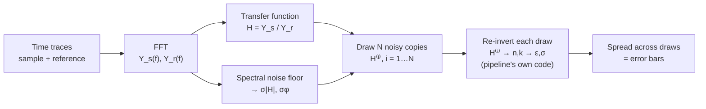

# THz‑TDS Uncertainty Propagation — Monte Carlo

*A first, principled error‑bar for n, k, ε and σ. Meant for the group meeting; deliberately quick, with a clear upgrade path.*

---

## The problem

We have a faithful uncertainty on the **transfer function** `H(f)`, but not on anything downstream. The inversion `H → n,k` and derivation `n,k → ε,σ` are **non‑linear**, so the error doesn't carry through by inspection. We want error bars on `n, k, ε, σ` **without** hand‑deriving Jacobians for every geometry (transmission, gold reflection, window reflection).

**Idea:** don't propagate formulas — propagate *samples*. Perturb `H` within its known uncertainty, run the **exact same inversion**, and read off the spread.

---

## The sequence of events



---

## Step 1 — Input uncertainty on H (the honest starting point)

White additive noise in time maps, by **Parseval**, to a **flat spectral noise floor**. The SNR mask already measures it: for a spectrum `Y`, the per‑bin relative amplitude error is

$$\frac{\sigma_{|Y|}}{|Y|} = \frac{\text{floor}}{|Y|} = 10^{-\,\mathrm{SNR_{dB}}/20}.$$

For the ratio `H = Y_s / Y_r`, sample and reference relative errors add in quadrature:

$$\boxed{\;\left(\frac{\sigma_{|H|}}{|H|}\right)^2 = 10^{-\,\mathrm{SNR^{samp}_{dB}}/10} + 10^{-\,\mathrm{SNR^{ref}_{dB}}/10}\;}$$

$$\sigma_{|H|}(f) = |H(f)|\sqrt{\;\cdot\;}\,,\qquad \sigma_{\varphi}(f) = \sqrt{\;\cdot\;}\ \text{[rad, small‑angle]}.$$

This is frequency‑dependent and **blows up exactly where a spectrum is weak** — self‑consistent with the trusted‑band mask.
*(Code: `compute_transfer_uncertainty` → `transfer_H_sigma`, `transfer_phase_sigma`.)*

---

## Step 2 — Draw N noisy copies of H

For each draw `i = 1…N` (default **N = 200**), perturb magnitude and phase independently:

$$|H^{(i)}| = |H| + \mathcal{N}(0,\ \sigma_{|H|}),\qquad \varphi^{(i)} = \varphi + \mathcal{N}(0,\ \sigma_{\varphi})$$
$$H^{(i)} = |H^{(i)}|\;e^{\,i\varphi^{(i)}}\qquad(|H^{(i)}|\ \text{clipped} \ge 0).$$

---

## Step 3 — Re‑invert every draw with the pipeline's own code

Feed each `H⁽ⁱ⁾` back through the **same** functions the run used:

$$H^{(i)} \xrightarrow{\;\text{invert\_nk}\,/\,\text{invert\_nk\_reflection}\;} (n^{(i)}, k^{(i)}) \xrightarrow{\;\text{derive\_eps\_sigma}\;} (\varepsilon^{(i)}, \sigma^{(i)})$$

with, for transmission,
$$n(f) = 1 - \frac{c\,\varphi(f)}{\omega d},\qquad k(f) = -\frac{c}{\omega d}\ln\!\Big[|H|\,\tfrac{(n+1)^2}{4n}\Big],$$
$$\varepsilon = (n + ik)^2,\qquad \sigma = -\,i\,\omega\,\varepsilon_0\,(\varepsilon - \varepsilon_\infty).$$

Because we **reuse the real inversion**, this automatically covers all geometries, the `r → −1` near‑singularity, and the built‑in `n/k` correlation — no new maths per pipeline.

---

## Step 4 — The spread *is* the uncertainty

Per frequency bin, collapse the N draws to a robust 1‑σ (half the 15.9–84.1 percentile width, so a stray 2π unwrap flip in one draw can't blow it up):

$$\boxed{\;\sigma_X(f) = \tfrac12\big[\,Q_{84.1}\{X^{(i)}(f)\} - Q_{15.9}\{X^{(i)}(f)\}\,\big]\;}\qquad X \in \{n, k, \varepsilon_{1,2}, \sigma_{1,2}\}.$$

Stored as `n_sigma, k_sigma, eps_real_sigma, eps_imag_sigma, sigma_real_sigma, sigma_imag_sigma` → the results viewer draws them as error bars and the CSV export writes them.
*(Code: `uncertainty.propagate_uncertainty`.)*

---

## What it does and does not tell you

- ✅ **Correct shape:** bars grow where SNR falls (band edges), shrink mid‑band — SNR‑aware and self‑consistent.
- ✅ **Geometry‑agnostic & nonlinear‑aware:** reuses the exact inversion; no per‑case formulas.
- ⚠️ **Optimistic (a lower bound):** the *input* captures only **additive white noise**. It misses **signal‑correlated** noise — timing jitter, amplitude drift — which inflates the on‑peak scatter. So absolute bar sizes are a floor, not the full budget.

### Upgrade path (swap the input, keep everything else)
Replace the input σ with the **measured per‑timepoint repeat scatter** `σ_t(t)` propagated through the windowed DFT,

$$\sigma_Y(f)^2 \approx \tfrac12\sum_t w(t)^2\,\sigma_t(t)^2,$$

which needs `stderr(t)` plumbed through baseline + window (currently dropped). The Monte‑Carlo machinery and the viewer/export wiring are **unchanged** — only the input uncertainty gets better.

---

## One‑line reproducibility

```python
thz.compute_transfer_uncertainty(dataset)          # Step 1: σ|H|, σφ
...                                                 # invert + derive
uncertainty.propagate_uncertainty(                 # Steps 2–4
    dataset,
    uncertainty.make_transmission_reinvert(thickness_m),   # or make_reflection_reinvert(**geom)
    n_draws=200,
)
```
Error bars then appear automatically in `launch_results_viewer(dataset)` and `export_quantities(dataset)`.
